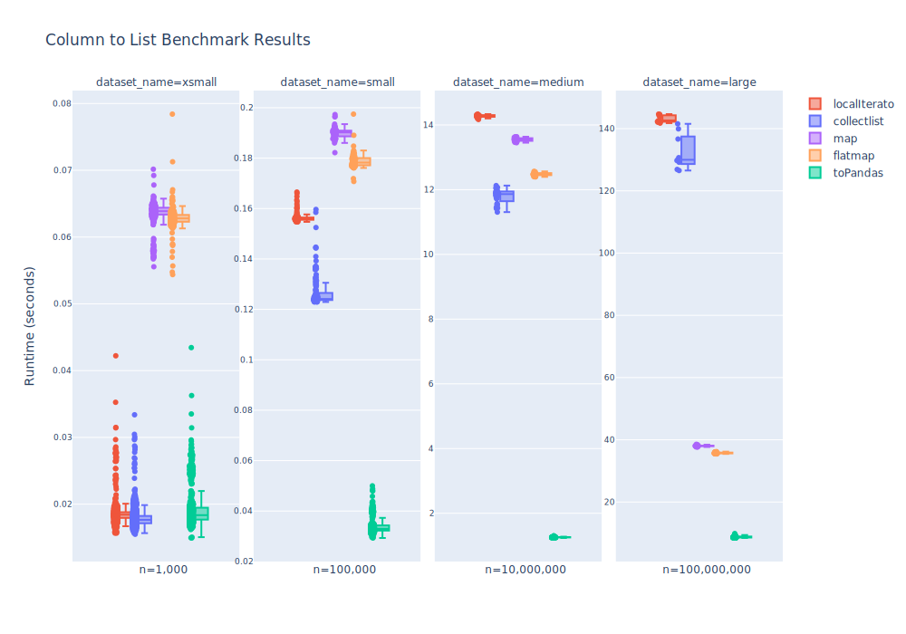
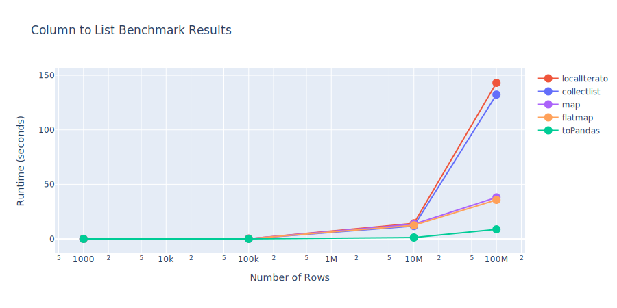

# Column to list performance

In PySpark, there are many approaches to accomplish the same task. Given a test DataFrame containing two columns - mvv and count, here are five methods to produce an identical list of mvv values using base PySpark functionality.

---

## Setup

```python
import pyspark.sql.functions as F
from pyspark.sql import SparkSession
```

```python
spark = SparkSession.builder.getOrCreate()
vals = [(0, 5), (1, 10), (2, 4), (3, 2), (4, 1)]
df = spark.createDataFrame(count_vals, schema="mvv int, count int")
```

---

## Approaches

### 1. toPandas()

```python
list(df.select("mvv").toPandas()["mvv"])
# [0, 1, 2, 3, 4]
```

### 2. flatMap

```python
df.select("mvv").rdd.flatMap(lambda x: x).collect()
# [0, 1, 2, 3, 4]
```

### 3. map

```python
df.select("mvv").rdd.map(lambda row: row[0]).collect()
# [0, 1, 2, 3, 4]
```

### 4. collect list comprehension

```python
[row[0] for row in df.select("mvv").collect()]
# [0, 1, 2, 3, 4]
```

### 5. toLocalIterator() list comprehension

```python
[row[0] for row in df.select("mvv").toLocalIterator()]
# [0, 1, 2, 3, 4]
```

---

## Benchmark Results

Substantial runtime differences were observed on the medium and large datasets:





All approaches have similar performance at 1K and 100k rows. `toPandas()` is consistently the fastest method across the tested dataset sizes, and exhibits the least variance in runtime. However, `pyarrow` and `pandas` are not required dependencies of Quinn so this method will only work with those packages available. For typical spark workloads, the `flatMap` approach is the next best option to use by default.

---

## Quinn Implementation

[:material-api: `quinn.column_to_list`](https://mrpowers.github.io/quinn/reference/quinn/dataframe_helpers)

To address these performance results, we updated `quinn.column_to_list()` to check the runtime environment and use the fastest method. If `pandas` and `pyarrow` are available, `toPandas()` is used. Otherwise, `flatmap` is used.

---

## More Information

### Datasets

Four datasets were used for this benchmark. Each dataset contains two columns - mvv and index. The mvv column is a monotonically increasing integer and the count column is a random integer between 1 and 10. The datasets were created using the `create_benchmark_df.py` script in `quinn/benchmarks`

| Dataset name | Number of rows | Number of files | Size on disk (mb) |
| ------------ | -------------- | --------------- | ----------------- |
| mvv_xsmall   | 1,000          | 1               | 0.005             |
| mvv_small    | 100,000        | 1               | 0.45              |
| mvv_medium   | 10,000,000     | 1               | 45                |
| mvv_large    | 100,000,000    | 4               | 566               |

---

### Validation

The code and results from this test are available in the `/benchmarks` directory of Quinn. To run this benchmark yourself:

#### 1. install the required dependencies

```bash
poetry install --with docs
```

#### 2. create the datasets

```bash
poetry run python benchmarks/create_benchmark_df.py
```

#### 3. run the benchmark

```bash
poetry run python benchmarks/benchmark_column_performance.py
```

Results will be stored in the `benchmarks/results` directory.
By default each implementation will run for the following durations:

| Dataset name | Duration (seconds) |
| ------------ | ------------------ |
| mvv_xsmall   | 20                 |
| mvv_small    | 20                 |
| mvv_medium   | 360                |
| mvv_large    | 1200               |

These can be adjusted in benchmarks/benchmark_column_performance.py if a shorter or longer duration is desired.

#### 4. Visualize the results

```bash
poetry run python benchmarks/visualize_benchmarks.py
```

.svg files will be saved in the `benchmarks/images` directory.
